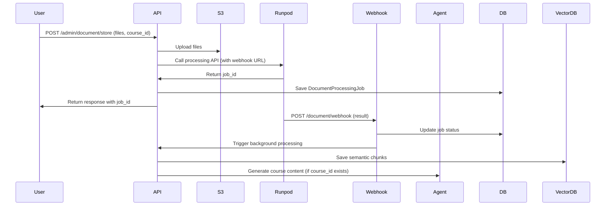

```mermaid
sequenceDiagram
    participant User
    participant API
    participant S3
    participant Runpod
    participant Webhook
    participant Agent

        User->>API: POST /admin/document/store (files, course_id)
        API->>S3: Upload files
        API->>Runpod: Call processing API (with webhook URL)
        Runpod->>API: Return job_id
        API->>DB: Save DocumentProcessingJob
        API->>User: Return response with job_id

        Runpod->>Webhook: POST /document/webhook (result)
        Webhook->>DB: Update job status
        Webhook->>API: Trigger background processing
        API->>VectorDB: Save semantic chunks
        API->>Agent: Generate course content (if course_id exists)
```
