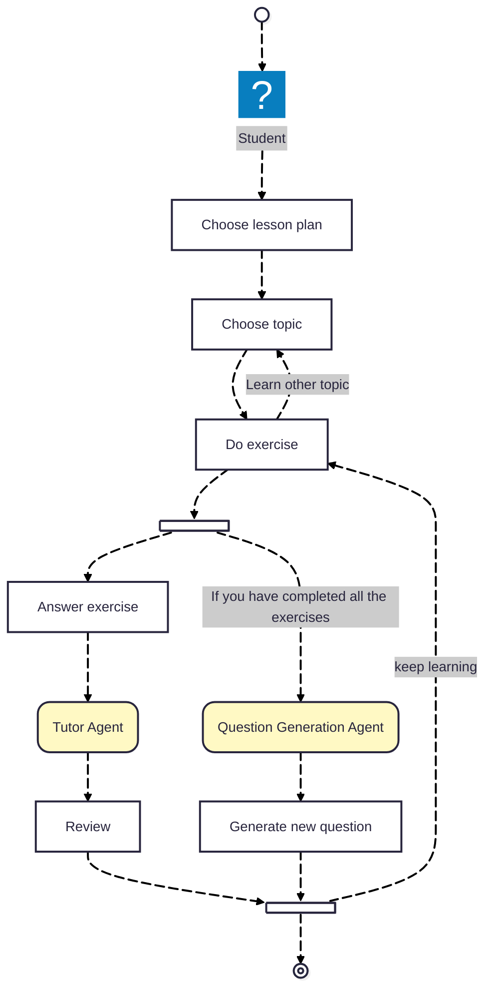

```mermaid
---
config:
  theme: redux
  look: classic
  layout: dagre
---
flowchart TD
    n5["Choose lesson plan"] L_n5_n9_0@--> n9["Choose topic"]
    n9 L_n9_n8_0@--> n8["Do exercise"]
    n8 L_n8_n11_0@--> n11["Fork/Join"]
    n11 L_n11_n6_0@--> n6["Answer exercise"]
    n11 L_n11_n1_0@-- "<span style=color:>If you have completed all the exercises</span>" --> n1@{ label: "<span style=\"white-space:\">Question Generation Agent</span>" }
    n1 L_n1_n10_0@--> n10["Generate new question"]
    n6 L_n6_n2_0@--> n2["Tutor Agent"]
    n2 L_n2_n7_0@--> n7["Review"]
    n7 L_n7_n12_0@--> n12["Fork/Join"]
    n10 L_n10_n12_0@--> n12
    n12 L_n12_n8_0@-- keep learning --> n8
    n12 L_n12_n14_0@--> n14["Stop"]
    n8 L_n8_n9_0@-- "<span style=color:>Learn other topic</span>" --> n9
    n3["Start"] L_n3_n13_0@--> n13["Student"]
    n13 L_n13_n5_0@--> n5
    n5@{ shape: rect}
    n9@{ shape: rect}
    n8@{ shape: rect}
    n11@{ shape: fork}
    n6@{ shape: rect}
    n1@{ shape: rounded}
    n10@{ shape: rect}
    n2@{ shape: rounded}
    n7@{ shape: rect}
    n12@{ shape: fork}
    n14@{ shape: stop}
    n3@{ shape: start}
    n13@{ icon: "azure:users", pos: "b"}
    style n1 fill:#FFF9C4
    style n2 fill:#FFF9C4
    L_n5_n9_0@{ animation: fast }
    L_n9_n8_0@{ animation: fast }
    L_n8_n11_0@{ animation: fast }
    L_n11_n6_0@{ animation: fast }
    L_n11_n1_0@{ animation: fast }
    L_n1_n10_0@{ animation: fast }
    L_n6_n2_0@{ animation: fast }
    L_n2_n7_0@{ animation: fast }
    L_n7_n12_0@{ animation: fast }
    L_n10_n12_0@{ animation: fast }
    L_n12_n8_0@{ animation: fast }
    L_n12_n14_0@{ animation: fast }
    L_n8_n9_0@{ animation: fast }
    L_n3_n13_0@{ animation: fast }
    L_n13_n5_0@{ animation: fast }

```
