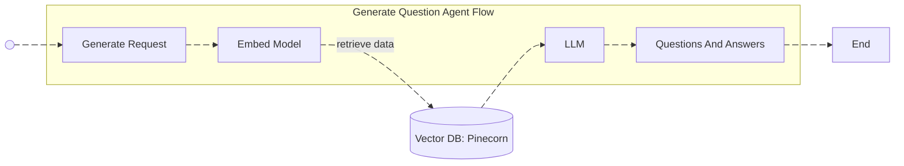

```mermaid
---
config:
  theme: default
  look: classic
  layout: dagre
---
flowchart LR
subgraph s1["Generate Question Agent Flow"]
        n1["Generate Request"]
        n2["Embed Model"]
        n4["LLM"]
        n5["Questions And Answers"]
  end
A["Start"] L_A_n1_0@--> n1
  n1 L_n1_n2_0@--> n2
    n2 L_n2_n3_0@-- retrieve data --> n3["Vector DB: Pinecorn"]
    n3 L_n3_n4_0@--> n4
    n4 L_n4_n5_0@--> n5
    n3@{ shape: cyl}
    X@{ shape: stop}
    A@{ shape: start}
    n5 L_n5_X_0@--> X["End"]
 L_A_n1_0@{ animation: fast }
    L_n1_n2_0@{ animation: fast }
    L_n2_n3_0@{ animation: fast }
    L_n3_n4_0@{ animation: fast }
    L_n4_n5_0@{ animation: fast }
    L_n5_X_0@{ animation: fast }
```
