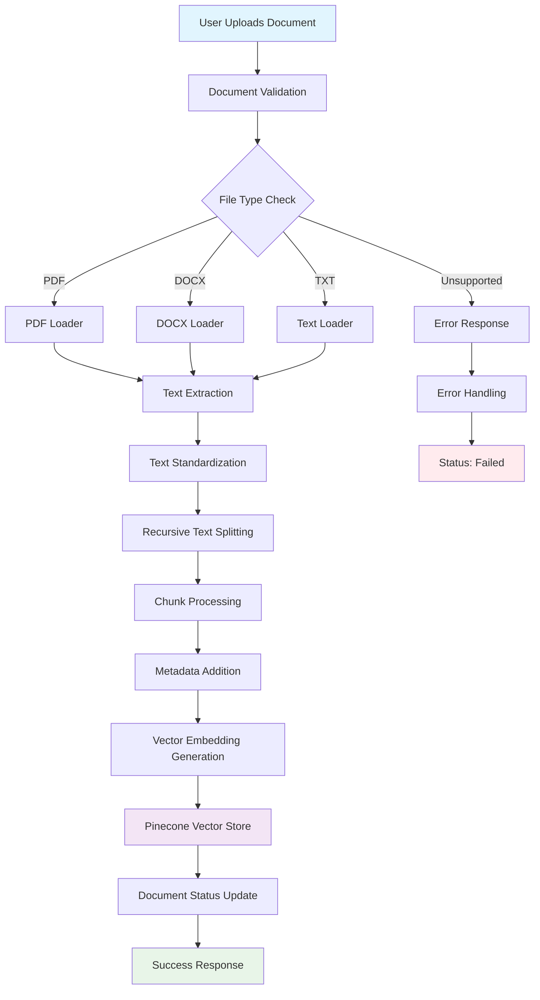
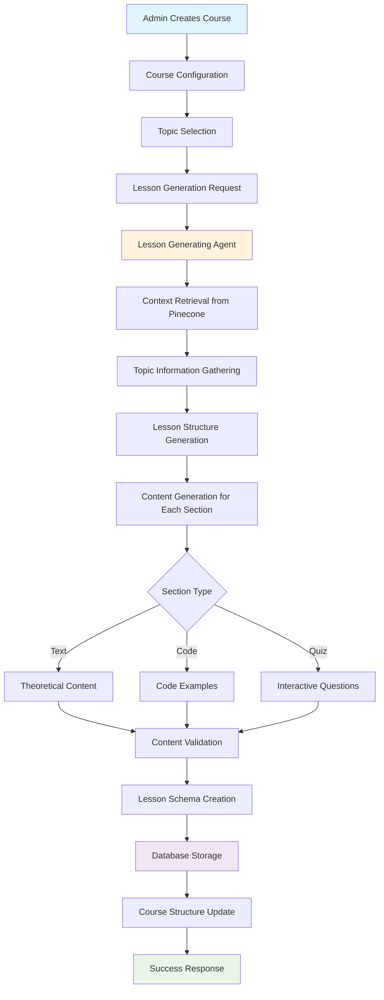
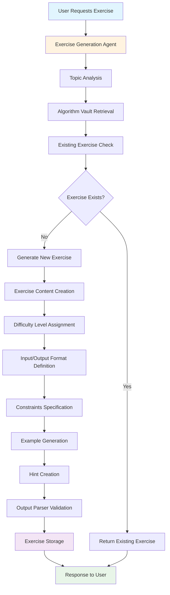
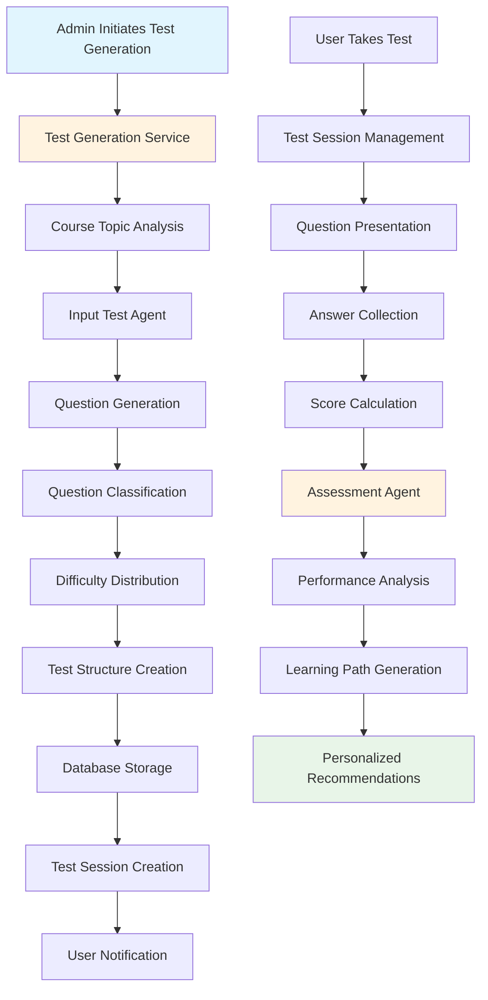
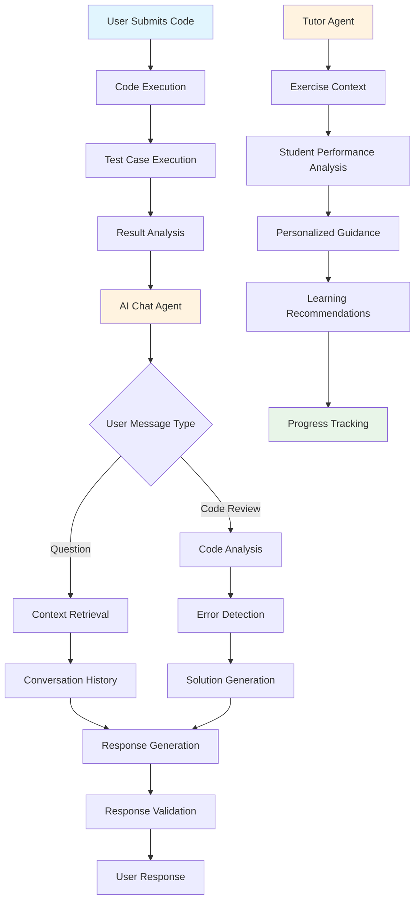
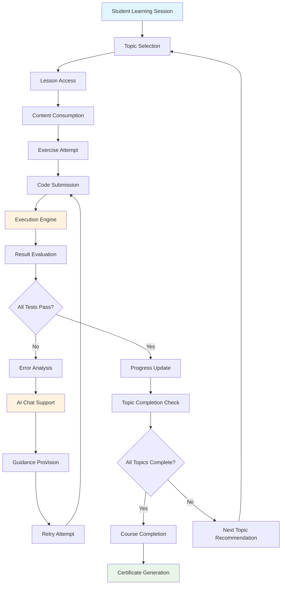
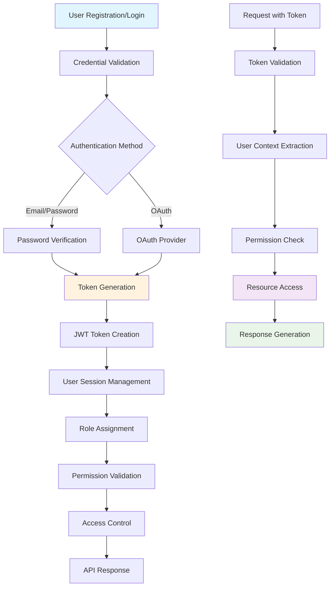
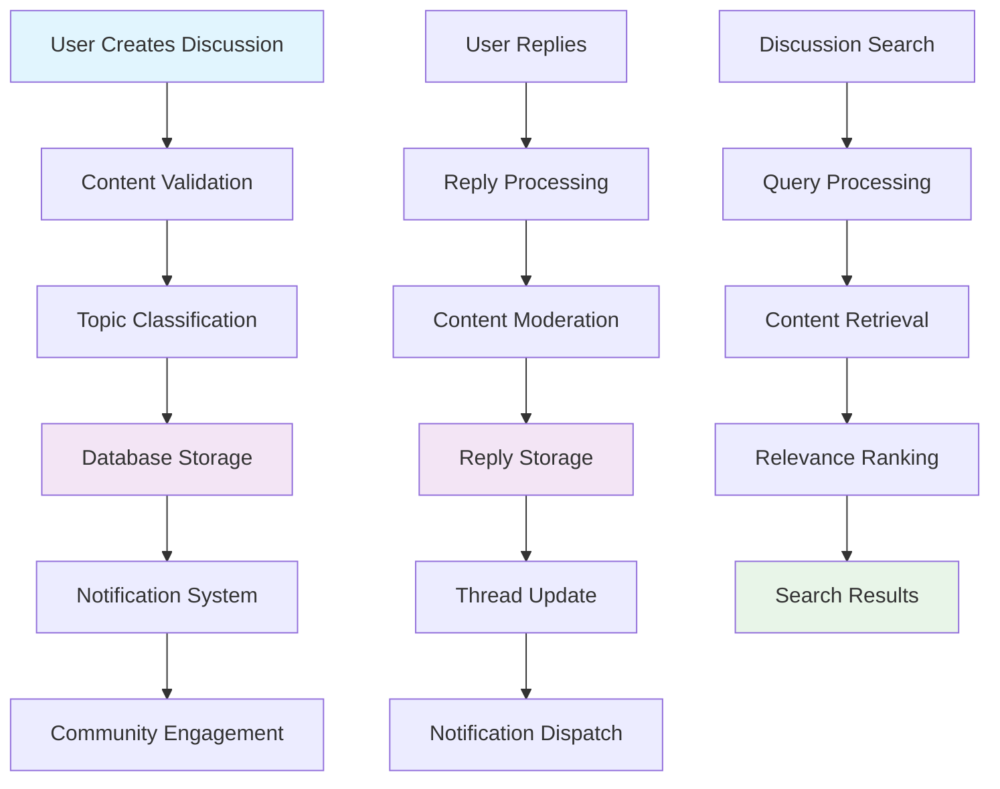
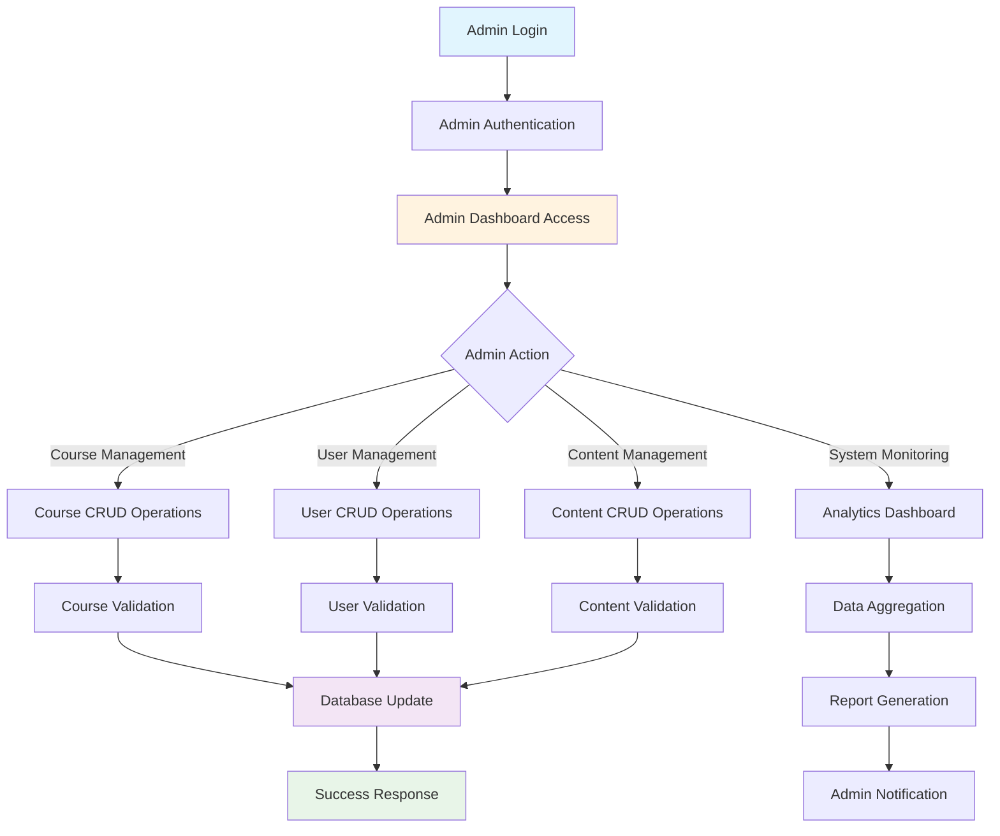
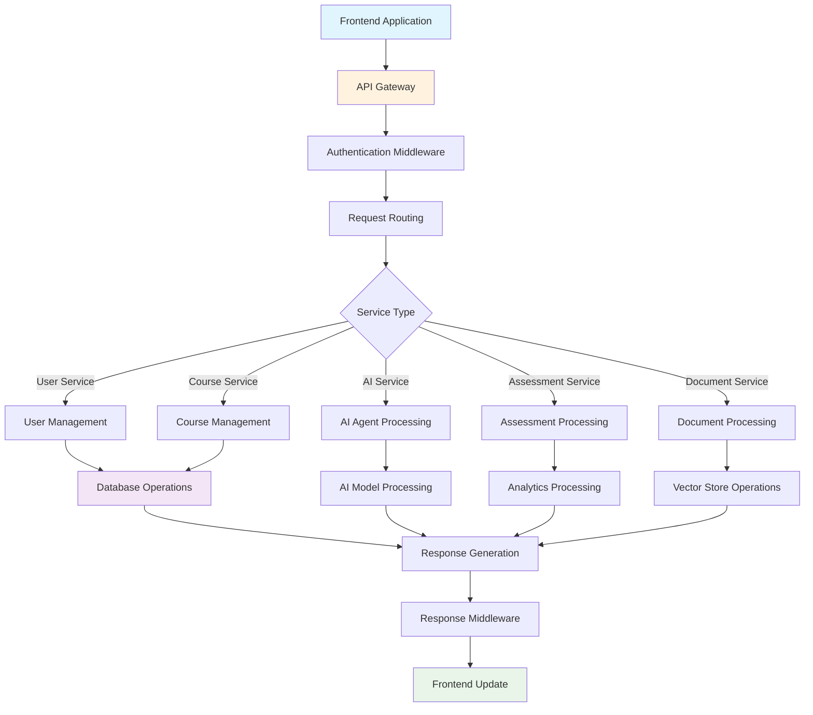

# AI Agent Giải Thuật - System Pipeline Diagrams

## 1. Document Processing and Indexing Pipeline

## 2. Course and Lesson Generation Pipeline

## 3. Exercise Generation and Management Pipeline

## 4. Test Generation and Assessment Pipeline

## 5. AI Chat and Tutoring Pipeline

## 6. Learning Progress and Assessment Pipeline

## 7. User Authentication and Authorization Pipeline

## 8. Discussion and Community Pipeline

## 9. Admin Management Pipeline

## 10. System Integration and Data Flow

## Key Components and Technologies

### AI Agents

- **Exercise Generation Agent**: Creates algorithm exercises using RAG
- **Assessment Agent**: Analyzes test results and generates learning paths
- **Lesson Generating Agent**: Creates educational content using RAG
- **AI Chat Agent**: Provides real-time tutoring support
- **Tutor Agent**: Offers personalized guidance

### Data Storage

- **PostgreSQL**: Primary database for user data, courses, tests
- **Pinecone**: Vector store for document embeddings and RAG
- **MongoDB**: Chat history and conversation management

### Core Services

- **Authentication Service**: JWT-based user authentication
- **Course Service**: Course and lesson management
- **Test Service**: Test generation and assessment
- **Document Service**: Document processing and indexing
- **Assessment Service**: Learning progress analysis

### Frontend Integration

- **Next.js**: React-based frontend application
- **Real-time Chat**: WebSocket-based AI chat interface
- **Code Editor**: Monaco Editor for code execution
- **Progress Tracking**: Real-time learning progress updates

This comprehensive pipeline architecture ensures seamless integration between all components while maintaining scalability and performance for the AI-powered learning platform.
