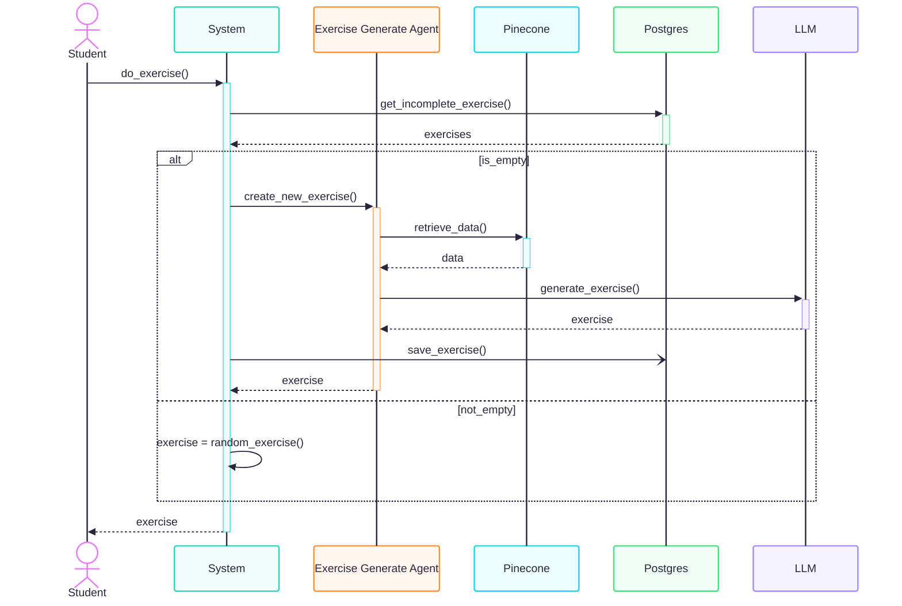

```mermaid
---
config:
  theme: redux-color
---
sequenceDiagram
  actor A1 as Student
  participant P1 as System
  participant P2 as Exercise Generate Agent
  participant P3 as Pinecone
  participant P4 as Postgres
  participant P5 as LLM
  A1 ->>+ P1: do_exercise()
  P1 ->>+ P4: get_incomplete_exercise()
  P4 -->>- P1: exercises
  alt is_empty
    P1 ->>+ P2: create_new_exercise()
    P2 ->>+ P3: retrieve_data()
    P3 -->>- P2: data
    P2 ->>+ P5: generate_exercise()
    P5 -->>- P2: exercise
    P1 -) P4: save_exercise()
    P2 -->>- P1: exercise
  else not_empty
    P1 ->> P1: exercise = random_exercise()
  end
  P1 -->>- A1: exercise
```
