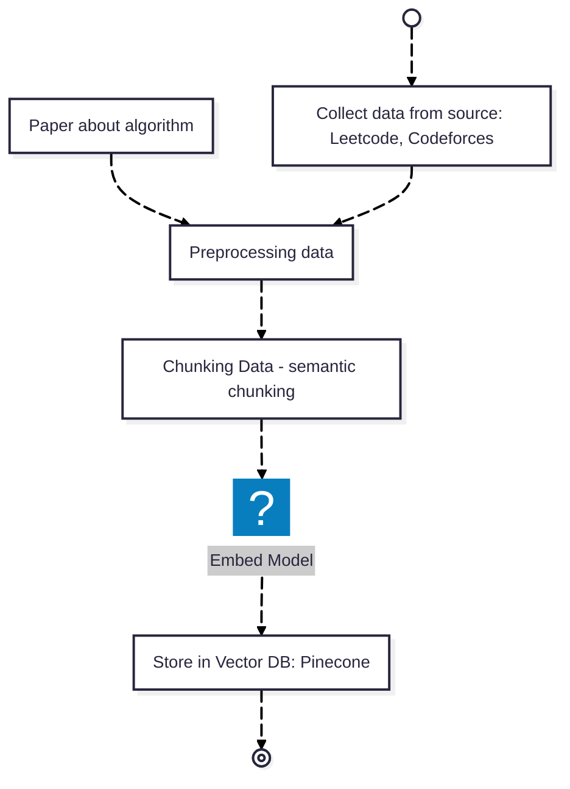

```mermaid
---
config:
  theme: redux
  look: neo
  layout: dagre
---
flowchart TD
    n1["Chunking Data - semantic chunking"] L_n1_n7_0@--> n7["Embed Model"]
    n5["Start"] L_n5_n4_0@--> n4["Collect data from source: Leetcode, Codeforces"]
    n2["Store in Vector DB: Pinecone"] L_n2_n6_0@--> n6["Stop"]
    n7 L_n7_n2_0@--> n2
    n8["Paper about algorithm"] L_n8_n9_0@--> n9["Preprocessing data"]
    n9 L_n9_n1_0@--> n1
    n4 L_n4_n9_0@--> n9
    n1@{ shape: proc}
    n7@{ icon: "gcp:ai-platform", pos: "b"}
    n5@{ shape: start}
    n4@{ shape: proc}
    n2@{ shape: proc}
    n6@{ shape: stop}
    n8@{ shape: rect}
    n9@{ shape: rect}
    L_n1_n7_0@{ animation: fast }
    L_n5_n4_0@{ animation: fast }
    L_n2_n6_0@{ animation: fast }
    L_n7_n2_0@{ animation: fast }
    L_n8_n9_0@{ animation: fast }
    L_n9_n1_0@{ animation: fast }
    L_n4_n9_0@{ animation: fast }


```
