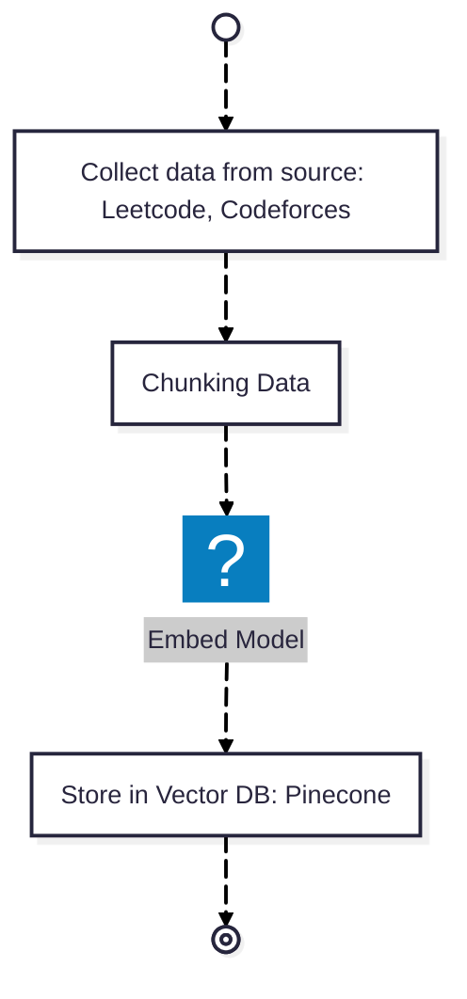

```mermaid
---
config:
  theme: redux
  look: neo
  layout: fixed
---
flowchart TD
    n1["Chunking Data"] L_n1_n7_0@--> n7["Embed Model"]
    n4["Collect data from source: Leetcode, Codeforces"] L_n4_n1_0@--> n1
    n5["Start"] L_n5_n4_0@--> n4
    n2["Store in Vector DB: Pinecone"] L_n2_n6_0@--> n6["Stop"]
    n7 L_n7_n2_0@--> n2
    n1@{ shape: proc}
    n7@{ icon: "gcp:ai-platform", pos: "b"}
    n4@{ shape: proc}
    n5@{ shape: start}
    n2@{ shape: proc}
    n6@{ shape: stop}
    L_n1_n7_0@{ animation: fast }
    L_n4_n1_0@{ animation: fast }
    L_n5_n4_0@{ animation: fast }
    L_n2_n6_0@{ animation: fast }
    L_n7_n2_0@{ animation: fast }
```
