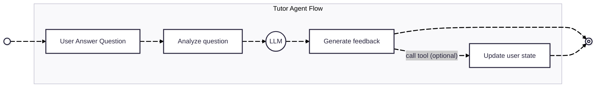

```mermaid
---
config:
  theme: redux
  look: classic
  layout: dagre
---
flowchart LR
 subgraph ss1["Tutor Agent Flow"]
        nn2["Analyze question"]
        nn3(("LLM"))
        nn4["Generate feedback"]
        nn1["User Answer Question"]
        n9["Update user state"]
  end
    nn1 L_nn1_nn2_0@--> nn2
    nn2 L_nn2_nn3_0@--> nn3
    nn3 L_nn3_nn4_0@--> nn4
    nn4 L_nn4_n7_0@--> n7["Stop"]
    nn4 L_nn4_n9_0@-- call tool (optional) --> n9
    n8["Start"] L_n8_nn1_0@--> nn1
    n9 L_n9_n7_0@--> n7
    nn1@{ shape: proc}
    n7@{ shape: stop}
    n8@{ shape: start}
    linkStyle 1 stroke:#000000,fill:none
    L_nn1_nn2_0@{ animation: fast }
    L_nn2_nn3_0@{ animation: fast }
    L_nn3_nn4_0@{ animation: fast }
    L_nn4_n7_0@{ animation: fast }
    L_nn4_n9_0@{ animation: fast }
    L_n8_nn1_0@{ animation: fast }
    L_n9_n7_0@{ animation: fast }

```
